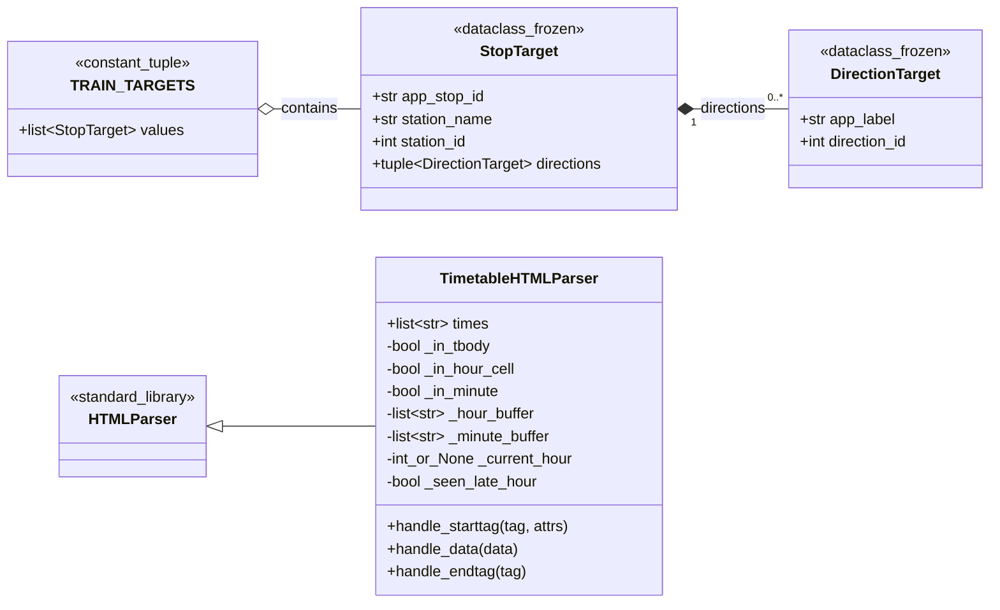
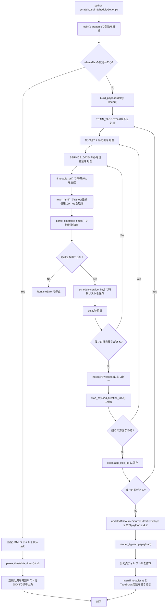
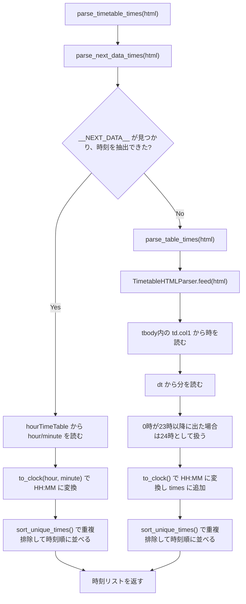

# trainScheduleGetter.py 説明

`trainScheduleGetter.py` は、ShindaiMapで使う鉄道駅の時刻表をYahoo!路線情報から取得し、アプリが読み込めるTypeScriptデータへ変換するスクリプトです。

主な出力先は `src/data/generated/trainTimetables.ts` です。`--html-file` を指定した場合は、保存済みHTMLを1件だけ解析して、正規化済みの時刻リストをJSONとして標準出力します。

## 全体像

- `TRAIN_TARGETS` に、取得対象の駅と方面を定義する。
- `SERVICE_DAYS` に、平日・土曜・日曜祝日の取得種別を定義する。
- 通常実行では、駅、方面、曜日種別の組み合わせごとにYahoo!路線情報の印刷用時刻表ページを取得する。
- 取得したHTMLは、まずNext.jsの `__NEXT_DATA__` から時刻を抽出する。
- `__NEXT_DATA__` が使えない場合は、`TimetableHTMLParser` でHTML表を直接解析する。
- 全駅分の時刻表をpayloadにまとめ、TypeScriptの定数として書き出す。

## クラス図



## 通常実行時の処理フロー



## HTML解析フロー



## 主要な関数の役割

| 関数 | 役割 |
| --- | --- |
| `progress()` | 進捗メッセージを標準エラーに出す。 |
| `to_clock()` | 時・分の数値を `HH:MM` 形式にする。 |
| `sort_unique_times()` | 時刻文字列の重複を消し、分換算で昇順に並べる。 |
| `parse_next_data_times()` | HTML内のNext.js JSONから時刻表を抽出する。 |
| `parse_table_times()` | HTML表を `TimetableHTMLParser` で解析する。 |
| `parse_timetable_times()` | Next.js JSON解析を優先し、失敗時にHTML表解析へフォールバックする。 |
| `timetable_url()` | 駅ID、方面ID、曜日種別からYahoo!路線情報の印刷用URLを組み立てる。 |
| `fetch_html()` | User-AgentなどのHTTPヘッダーを付けてHTMLを取得する。 |
| `build_payload()` | 全駅・全方面・全曜日種別を取得して、出力用payloadを作る。 |
| `render_typescript()` | payloadをTypeScriptの `generatedTrainTimetables` 定数へ整形する。 |
| `main()` | CLI引数を処理し、HTML単体解析またはTypeScript生成を実行する。 |

## 出力データ構造

```text
payload
├── updatedAt: UTCの生成日時
├── source: "Yahoo!路線情報"
├── sourceUrlPattern: 取得元URLのパターン
└── stops
    └── [app_stop_id]
        └── [direction_label]
            ├── weekday: 平日時刻リスト
            ├── saturday: 土曜時刻リスト
            ├── holiday: 日曜・祝日時刻リスト
            └── weekend: holidayと同じ時刻リスト
```

`weekend` は既存のアプリ側コードが参照できるように、`holiday` と同じ内容をコピーしています。
